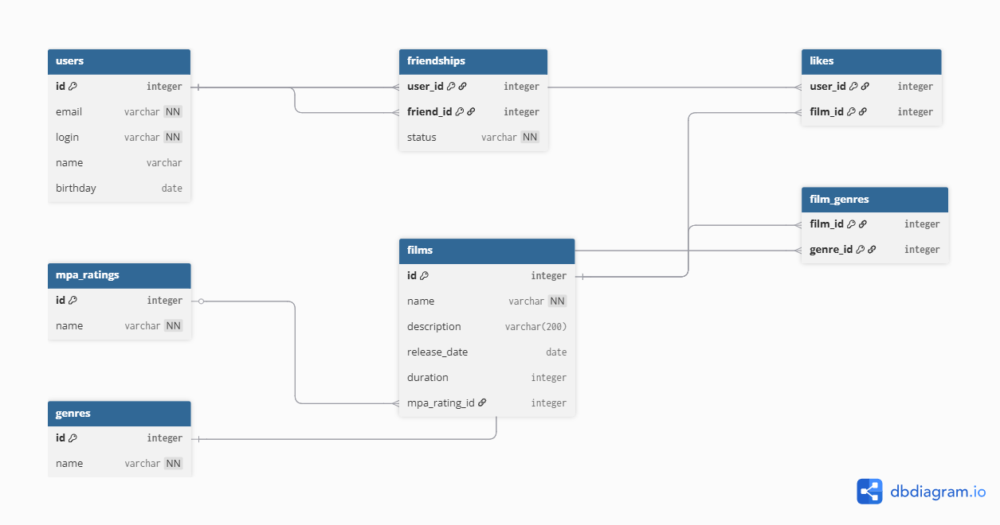

### Схема базы данных


База данных состоит из 7 таблиц:
- **users** — пользователи
- **films** — фильмы
- **mpa_ratings** — рейтинги MPA (G, PG, PG-13, R, NC-17)
- **genres** — жанры
- **film_genres** — связь фильмов с жанрами
- **likes** — лайки фильмов
- **friendships** — дружба между пользователями

## Примеры запросов

### 1. Топ-5 популярных фильмов
```sql
SELECT f.name, COUNT(l.user_id) as likes
FROM films f
LEFT JOIN likes l ON f.id = l.film_id
GROUP BY f.id
ORDER BY likes DESC
LIMIT 5;
```

### 2. Жанры конкретного фильма
```sql
SELECT g.name
FROM films f
JOIN film_genres fg ON f.id = fg.film_id
JOIN genres g ON fg.genre_id = g.id
WHERE f.id = 1;  -- id фильма
```

### 3. Все друзья пользователя
```sql
SELECT u.*
FROM users u
JOIN friendships f ON u.id = f.friend_id
WHERE f.user_id = 1 AND f.status = 'CONFIRMED';
```

### 4. Неподтверждённые запросы в друзья
```sql
SELECT u.*
FROM users u
JOIN friendships f ON u.id = f.user_id
WHERE f.friend_id = 1 AND f.status = 'PENDING';
```